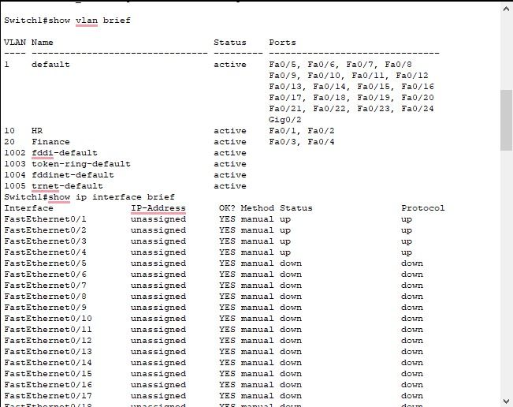
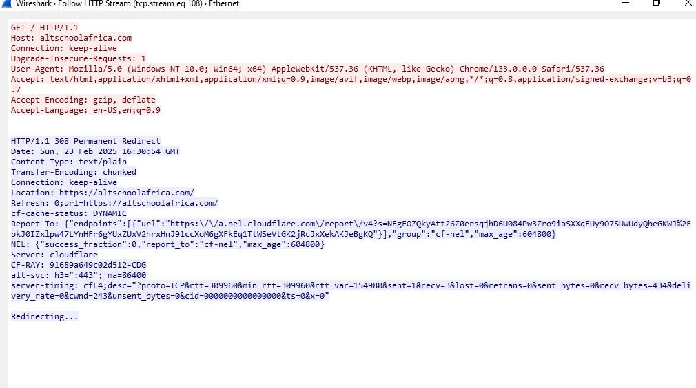
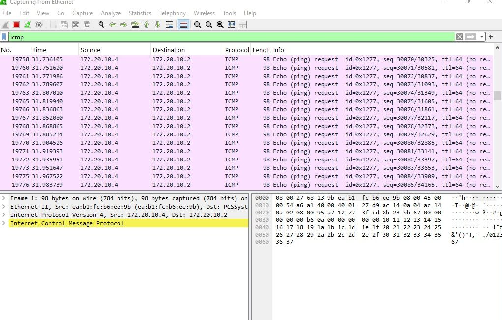

# Network Security Lab

This lab combines several hands-on exercises in Cisco Packet Tracer, Wireshark, and Kali Linux to explore how networks are set up, monitored, and attacked; and why security controls matter.

---

## 1. Setting Up and Securing a Network

- Built a small enterprise network in **Cisco Packet Tracer**.  
- Configured **VLANs** to segment traffic.  
- Applied **router ACLs** to filter traffic by IP, ports, and protocols (like basic firewall rules).  
- Learned how these controls reduce cyber threats and prevent lateral movement.

---

## 2. Monitoring Traffic with Wireshark

- Captured and analyzed traffic in real time.  
- Filtered **HTTP requests**, observed **ICMP packets**, and inspected data flows.  
- Realized this mirrors what **SOC analysts** do to spot suspicious activity.  
- Noted how attackers can misuse the same tool for packet sniffing, reinforcing why secure protocols (TLS/HTTPS) are critical.

---

## 3. Simulating an ICMP Flood Attack

- Launched an **ICMP flood attack** from my Kali Linux VM to my Windows machine.  
- Target system quickly became overwhelmed, showing high latency in Wireshark.  
- Understood how this small-scale test mimics real-world **DDoS attacks**.  
- Learned about defenses like rate-limiting, IDS/IPS, and services like **Cloudflare** or **AWS Shield**.

---

## 4. Why HTTPS Matters
- Accessed an **HTTP site** and captured GET requests in Wireshark.  
- Saw data in **plaintext**, proving how insecure HTTP is.  
- Reinforced the importance of **HTTPS** to protect sensitive data, especially on public Wi-Fi.

---

## 📝 Lessons Learned
This project showed me how attackers think, how defenders respond, and why even “simple” security practices like **encryption, segmentation, and monitoring** are essential in protecting networks.
